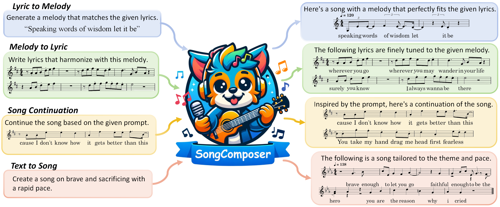

#  SongComposer
This repository is the official implementation of SongComposer.

<!-- **[SongComposer: A Large Language Model for Lyric and Melody Composition in Song Generation](https://arxiv.org/abs/2402.17645)**
</br> -->
<p align="center" style="font-size: 1.5em; margin-top: -1em"> <a href="https://arxiv.org/pdf/2402.17645"><b>SongComposer: A Large Language Model for Lyric and Melody Composition in Song Generation</b></a></p>
<p align="center" style="font-size: 1.1em; margin-top: -1em">
<a href="https://mark12ding.github.io/">Shuangrui Ding<sup>*1</sup></a>,  
<a href="https://scholar.google.com/citations?user=iELd-Q0AAAAJ">Zihan Liu<sup>*2,3</sup></a>,  
<a href="https://scholar.google.com/citations?user=FscToE0AAAAJ">Xiaoyi Dong<sup>3</sup></a>,  
<a href="https://panzhang0212.github.io/">Pan Zhang<sup>3</sup></a>,  
<a href="https://shvdiwnkozbw.github.io/">Rui Qian<sup>1</sup></a>,  
<a href="https://conghui.github.io/">Conghui He<sup>3</sup></a>,  
<a href="http://dahua.site/">Dahua Lin<sup>3</sup></a>,  
<a href="https://myownskyw7.github.io/">Jiaqi Wang<sup>&dagger;3</sup></a> 
</p>
<p align="center" style="font-size: 1em; margin-top: -1em"><sup>1</sup>The Chinese University of Hong Kong, <sup>2</sup>Beihang University, <sup>3</sup>Shanghai AI Laboratory</p>
<p align="center" style="font-size: 1em; margin-top: -1em"> <sup>*</sup>  Equal Contribution. <sup>&dagger;</sup>Corresponding authors. </p>

<p align="center" style="font-size: em; margin-top: 0.5em">
<a href="https://arxiv.org/abs/2402.17645">"></a>
<a href="https://github.com/pjlab-songcomposer/songcomposer"></a>
<a href="https://pjlab-songcomposer.github.io"></a>
</p>



## 📜 News
🚀 [2023/6/12] We enhanced SongComposer to a whole-song level and the [demo page](https://pjlab-songcomposer.github.io) is updated!

🚀 [2023/3/21] The finetune code of [SongComposer](https://github.com/pjlab-songcomposer/songcomposer/tree/main/finetune) are publicly available and the weights of [SongComposer_pretrain](https://huggingface.co/Mar2Ding/songcomposer_pretrain) and [SongComposer_sft](https://huggingface.co/Mar2Ding/songcomposer_sft) are publicly available on Hugging Face🤗.

🚀 [2023/2/28] The [paper](https://arxiv.org/abs/2402.17645) and [demo page](https://pjlab-songcomposer.github.io) are released!

## 💡 Highlights
- 🔥 SongComposer composes melodies and lyrics with symbolic song representations, with the benefit of
**better token efficiency**, **precise representation**, **flexible format**, and **human-readable output**.
- 🔥 SongCompose-PT, a comprehensive pretraining dataset that includes lyrics, melodies, and
paired lyrics and melodies in either Chinese or English, will be released.
- 🔥 SongComposer outperforms advanced LLMs like GPT-4 in tasks such as lyric-to-melody generation, melody-to-lyric generation, song continuation, and text-to-song creation.

## 👨‍💻 Todo
- [ ] Release of SongCompose-PT dataset
- [ ] Online Demo of SongComposer
- [x] Code of SongComposer
- [x] Demo of SongComposer


## 🛠️ Usage
### Requirements

- python 3.9 and above
- pytorch 2.0 and above
- CUDA 12.0 and above are recommended (this is for GPU users)


### Installation

Before running the code, make sure you have setup the environment and installed the required packages. Make sure you meet the above requirements, and then install the dependent libraries.
Please refer to the installation section of [finetune scripts](finetune/README.md).

### Quickstart

We provide a simple example to show how to use SongComposer-SFT with 🤗 Transformers.

<details>
  <summary>
    <b>🤗 Transformers</b>
  </summary>

```python
from transformers import AutoTokenizer, AutoModelForCausalLM
ckpt_path = "Mar2Ding/songcomposer_sft"
tokenizer = AutoTokenizer.from_pretrained(ckpt_path, trust_remote_code=True)
model = AutoModel.from_pretrained(ckpt_path, trust_remote_code=True).cuda().half()
prompt = 'Create a song on brave and sacrificing with a rapid pace.'
model.inference(prompt, tokenizer)
```

</details>


### Finetune

Please refer to our [finetune scripts](finetune/README.md).


### Inference

We have provide a notebook (`inference.ipynb`) for the inference stage.

##   ⭐ Samples
Audio samples, including our SongComposer and other baselines, are available on our [Demo Page](https://pjlab-songcomposer.github.io). The samples span four tasks related to song generation, covering both English and Chinese.


<!-- ## ❤️ Acknowledgments -->


## ✒️ Citation
If you find our work helpful for your research, please consider giving a star ⭐ and citation 📝
```bibtex
@misc{ding2024songcomposer,
      title={SongComposer: A Large Language Model for Lyric and Melody Composition in Song Generation}, 
      author={Shuangrui Ding and Zihan Liu and Xiaoyi Dong and Pan Zhang and Rui Qian and Conghui He and Dahua Lin and Jiaqi Wang},
      year={2024},
      eprint={2402.17645},
      archivePrefix={arXiv},
      primaryClass={cs.SD}
}
```

<!-- ## License -->

